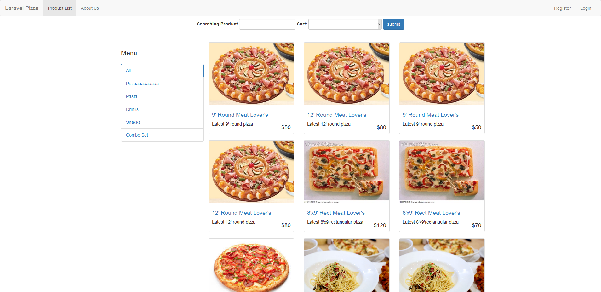

# Laravel Pizza
This is a Pizza shop implemented by [Laravel](https://laravel.com/). UI framework using [Bootstrap](http://getbootstrap.com/).



# Requirement
php7

# Setup
1. Just clone the source
```
    git clone https://github.com/kapokyue/laravel-pizza.git && cd laravel-pizza
```
2. Use composer to download the dependencies
```
    composer install
```
2. Import the shop.sql to relational database(mysql, postgresql, etc...) *(Use phpMyAdmin or whatever you like)*

4. Start the server (eg. Naginx, Apache ...), or use the Laravel's artisan server
```
    php artisan serve
```
5. Enjoy!

## License
MIT